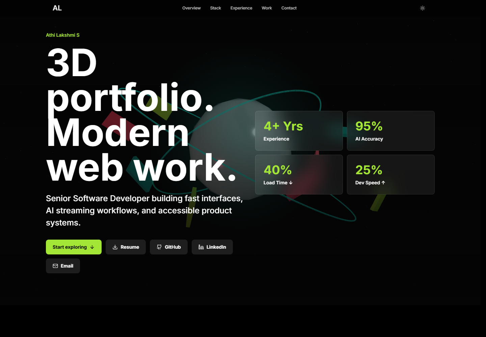
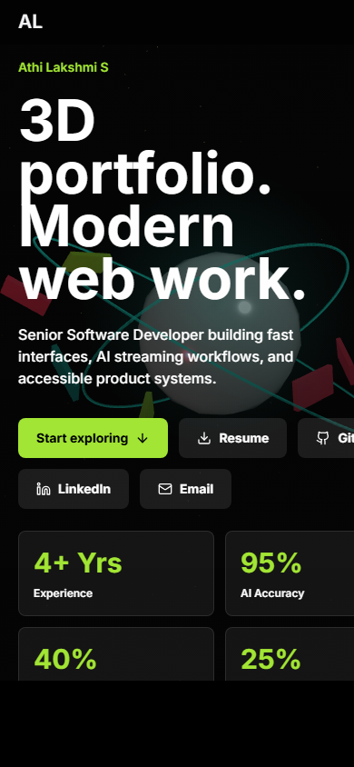

# Athi Lakshmi S Portfolio

A modern, responsive portfolio website for Athi Lakshmi S, built with React, TypeScript, Tailwind CSS, Framer Motion, and Three.js.

Live site: [athilakshmi07.github.io/athilakshmi-portfolio](https://athilakshmi07.github.io/athilakshmi-portfolio/)

## Screenshots

### Desktop



### Mobile



## Overview

This portfolio presents professional experience, technical skills, selected projects, resume access, and contact links in a polished interactive interface. It includes a 3D-inspired hero section, smooth motion effects, responsive layouts, and GitHub Pages deployment through GitHub Actions.

## Features

- Responsive design for desktop and mobile screens
- Interactive modern hero section with 3D visual elements
- Smooth scroll and reveal animations
- Skills grouped by frontend, AI/streaming, backend, and tools
- Experience and project sections
- Resume, GitHub, LinkedIn, and email links
- Automated deployment to GitHub Pages

## Tech Stack

- React 18
- TypeScript
- Vite
- Tailwind CSS
- Framer Motion
- Three.js
- Lucide React
- GitHub Actions
- GitHub Pages

## Getting Started

Clone the repository:

```bash
git clone https://github.com/Athilakshmi07/athilakshmi-portfolio.git
cd athilakshmi-portfolio
```

Install dependencies:

```bash
npm install
```

Start the development server:

```bash
npm run dev
```

Build for production:

```bash
npm run build
```

Preview the production build:

```bash
npm run preview
```

## Deployment

The site is deployed with GitHub Pages using the workflow in:

```text
.github/workflows/deploy.yml
```

Every push to the `main` branch runs the production build and publishes the `dist` output to GitHub Pages.

The Vite base path is configured for this repository in:

```text
vite.config.ts
```

```ts
base: '/athilakshmi-portfolio/'
```

## Project Structure

```text
athilakshmi-portfolio/
|-- .github/workflows/deploy.yml
|-- docs/screenshots/
|-- public/
|-- src/
|   |-- components/
|   |-- data/
|   |-- hooks/
|   |-- App.tsx
|   |-- index.css
|   `-- main.tsx
|-- index.html
|-- package.json
|-- tailwind.config.js
|-- tsconfig.json
`-- vite.config.ts
```

## Contact

- GitHub: [Athilakshmi07](https://github.com/Athilakshmi07)
- LinkedIn: [athilakshmi-s](https://linkedin.com/in/athilakshmi-s)
- Email: [athilak1999@gmail.com](mailto:athilak1999@gmail.com)
